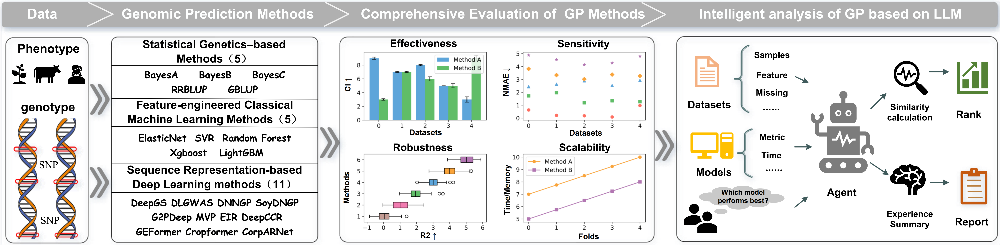

# GPBench

GPBench is a benchmarking toolkit for genomic prediction. This repository reimplements and integrates many commonly used methods, including classic linear statistical approaches and machine learning / deep learning methods: rrBLUP, GBLUP, BayesA/B/C, SVR, Random Forest, XGBoost, LightGBM, DeepGS, DL_GWAS, G2PDeep, MVP, DNNGP, SoyDNGP, DeepCCR, EIR, Cropformer, GEFormer, CropARNet, etc.

Project Website: [https://www.sdu-idea.cn/GPBench/](https://www.sdu-idea.cn/GPBench/)



## Key Features
- Implements multiple genomic prediction methods and reproducible experimental workflows
- Supports GPU-accelerated deep learning methods (using PyTorch)
- Unified data loading and 10-fold cross-validation pipeline
- Outputs standardized evaluation metrics (PCC, MAE, MSE, R2) and per-fold predictions
- **LLM-powered analysis tool** (`gp_agent_tool`): Analyzes dataset characteristics, finds similar datasets, and recommends suitable genomic prediction methods based on historical experimental experience

## Important Structure
- `data/`: Example/real dataset directory, each species/dataset is a subfolder (e.g., `data/Cotton/`), containing:
	- `genotype.npz`: genotype matrix (typically saved as a NumPy array)
	- `phenotype.npz`: phenotype data (contains phenotype matrix and phenotype names)
- `method_reg/`: subdirectories with implementations for each method (each method usually contains a main runner script plus hyperparameter/utility scripts)
- `result/`: default output directory for experimental results
- `gp_agent_tool/`: LLM-powered dataset analysis and method recommendation tool (see [Dataset Analysis Tool](#dataset-analysis-tool-gp_agent_tool) section)
- `environment.yml`: dependency file for creating a conda environment (recommended)

## Environment Setup (3 Options)

GPBench provides three recommended ways to set up the runtime environment. Choose **one** that best fits your use case.

------

### Option 1 (Recommended): Conda via `environment.yml`

This repository ships with an `environment.yml`. It is recommended to create and activate a Conda environment from it:

```
# On a machine with conda:
conda env create -f environment.yml
conda activate Benchmark
```

Notes:

- `environment.yml` contains most dependencies (including CUDA / cuDNN related packages and pip list) and is suitable for GPU-enabled environments (the file may reference CUDA 11.8 and matching RAPIDS/torch/cupy versions).
- Ensure the target machine has an NVIDIA driver compatible with your CUDA runtime.
- If you cannot use `environment.yml` directly, you may install the main dependencies manually (simplified):

```
pip install -U numpy pandas scikit-learn torch torchvision optuna psutil xgboost lightgbm
```

> Warning: The simplified installation may require additional platform-specific steps on GPU systems (e.g., CUDA/CuPy/cuML compatibility).

------

### Option 2: Install from PyPI (`pip install GPBench`)

If you only want to use GPBench as a Python package (without cloning this repo), you can install it directly via pip，follow this exact order:

#### 1. Create Base Environment (Python & R)

Create an isolated Conda environment with Python and R base installed:

```
conda create -n gpbench python=3.9 r-base=4.3.2 -c conda-forge -y
conda activate gpbench
```

#### 2. Install GPBench Package

Install the main package via pip. This pulls the basic Python dependencies:

```
pip install GPBench
```

#### 3. Install R Dependencies

Install the required R libraries (`MASS`, `rrBLUP`, `BGLR`) via conda-forge:

```
conda install -c conda-forge r-mass r-rrblup r-bglr -y
```

#### 4. Install GPU Dependencies (CuPy / cuML)

Install `cupy` and `cuml` matching your system's CUDA version.
*Example (for CUDA 12.x):*

```
conda install -c rapidsai -c conda-forge -c nvidia cupy cuml cuda-version=12 -y
```

> **Note:** Change `cuda-version=12` to `11` if you are using an older driver.

#### 5. Run Import Self-Test

Finally, verify that the installation is complete and all backends are linking correctly:

```
python -c "import gpbench; gpbench.test()"
```

If successful, you will see: `✅ All imports passed successfully!`

------

### Option 3: Docker (Build from the provided `Dockerfile`)

For a fully reproducible environment (recommended for deployment/CI), build a Docker image using the `Dockerfile` in this repository.

#### 1. Build the Docker image

From the repository root:

```
docker build -t gpbench:1.0 .
```

> **Note:** You may need `sudo` depending on your Docker installation and permissions.

#### 2. Run the container

Start an interactive shell (with GPU support):

```
docker run --gpus all -it --rm gpbench:1.0 bash
```

Or run a single command directly:

```
docker run --rm gpbench:1.0 python method_reg/BayesA/BayesA.py
# or
docker run --rm gpbench:1.0 python method_class/BayesA/BayesA_class.py
```

> **Tip:** If you intend to use a GPU, keep `--gpus all` in the `docker run` command.

## Data Format and Preparation
- Each species folder should contain `genotype.npz` and `phenotype.npz`.
- `genotype.npz` usually stores a 2D array (number of samples × number of SNPs).
- `phenotype.npz` typically includes two arrays: the phenotype matrix (number of samples × number of phenotypes) and a list of phenotype names.

Quickly view phenotype names for a dataset (e.g., `Cotton`):

```bash
python - <<'PY'
import numpy as np
obj = np.load('data/Cotton/phenotype.npz')
print(obj['arr_1'])
PY
```

## Quick Start (example with a method)
Most methods have a main script under `method_reg/<Method>/`. Scripts usually accept parameters like `--methods`, `--species`, `--phe`, `--data_dir`, `--result_dir`, etc. Example:

```bash
# 1) Activate the environment
conda activate Benchmark

# 2) Run a single phenotype with DeepCCR (note: include trailing slash after --species)
python method_reg/DeepCCR/DeepCCR.py \
	--methods DeepCCR/ \
	--species Cotton/ \
	--phe FibLen_17_18 \
	--data_dir data/ \
	--result_dir result/
```

Common optional arguments (may vary across scripts):
- `--epoch`: number of training epochs (example scripts often default to 1000)
- `--batch_size`: batch size
- `--lr`: learning rate
- `--patience`: early stopping patience

You can inspect the argparse help for the specific script in the method directory:

```bash
python method_reg/DeepCCR/DeepCCR.py -h
```

## Dataset Analysis Tool (gp_agent_tool)

The `gp_agent_tool` is an LLM-powered analysis tool that performs comprehensive dataset analysis and automatically recommends suitable genomic prediction methods. It analyzes your dataset characteristics, computes statistical features, finds similar datasets from historical experiments, and provides evidence-based method recommendations.

### Features
- **Dataset statistical analysis**: Automatically computes and analyzes dataset statistics including sample size, marker count, phenotype distribution, missing rates, and statistical properties
- **Similar dataset discovery**: Finds datasets with similar statistical distributions to your query dataset from historical experimental databases
- **Method recommendation**: Recommends genomic prediction methods that have shown best performance on similar datasets based on historical experience
- **Bilingual support**: Supports both Chinese and English queries and analysis
- **Experience-based insights**: Leverages comprehensive historical experimental results to provide evidence-based analysis and recommendations

### Prerequisites

1. **LLM Configuration**: Create a configuration file at `gp_agent_tool/config/config.json` with your LLM API settings:

```json
{
  "llm": {
    "model": "gpt-4o-mini",
    "api_key": "YOUR_OPENAI_API_KEY",
    "base_url": "https://api.openai.com/v1",
    "timeout_seconds": 60,
    "max_retries": 3
  },
  "codegen_llm": {
    "model": "gpt-4o-mini",
    "api_key": "YOUR_OPENAI_API_KEY",
    "base_url": "https://api.openai.com/v1",
    "timeout_seconds": 60,
    "max_retries": 3
  },
  "multimodal_llm": {
    "model": "qwen-vl-max",
    "api_key": "YOUR_DASHSCOPE_API_KEY"
  }
}
```

**Important**: Please replace the `api_key` fields in the configuration file with your own API keys:
- Replace `YOUR_OPENAI_API_KEY` in `llm` and `codegen_llm` with your OpenAI API key
- Replace `YOUR_DASHSCOPE_API_KEY` in `multimodal_llm` with your Alibaba Cloud DashScope API key

You can obtain API keys from the following URLs:
- OpenAI API key: https://platform.openai.com/api-keys
- Alibaba Cloud DashScope API key: https://dashscope.console.aliyun.com/apiKey

2. **Additional Dependencies**: Install required packages for the tool:

```bash
pip install langchain langgraph openai
```

### Usage

#### Basic Usage

Run the tool from the project root directory:

```bash
cd gp_agent_tool
python main.py \
  -q "Based on existing models, summarize the patterns in the mkg trait of cattle." \
  -o result.json
```

Or in English:

```bash
python main.py \
  -d ../data/Rapeseed \
  -q "Recommend the best methods for this dataset" \
  -o result.json
```

#### Command-line Arguments

- **`-d / --dataset`** (optional): Path to the dataset directory containing `genotype.npz` and `phenotype.npz`. The tool will analyze this dataset to compute statistical features. If not provided, analysis and recommendations are based on the complete experience table only.
- **`-q / --user-query`** (required): Your analysis requirement or question description (supports both Chinese and English). Examples: "分析这个数据集的特征" / "Analyze this dataset and recommend methods" / "What methods work best for binary phenotypes?"
- **`-m / --mask`** (optional): Specify a `species/phenotype` (e.g., `Rapeseed/FloweringTime`) to mask in the reference experience database, preventing "answer leakage" when evaluating on known datasets.
- **`-o / --output`** (optional): Path to save the analysis result as a JSON file. If not provided, results are printed to the terminal.

#### Dataset Analysis Features

When a dataset path is provided, the tool automatically computes the following statistical features:

- **Sample information**: Total samples, valid samples, missing rate
- **Marker information**: Number of markers, genotype statistics (mean, std, missing rate, MAF)
- **Phenotype statistics**: Mean, std, min, max, median, skewness, kurtosis
- **Data type information**: Genotype and phenotype data types, binary phenotype detection

#### Example Output

The tool returns a JSON object with two main sections:

```json
{
  "similar_datasets": {
    "items": ["Chickpea/Days_to_0.5_flowering", "Cotton/FibLen_17_18"],
    "reason": "These datasets have similar statistical distributions..."
  },
  "methods": {
    "items": ["GBLUP", "XGBoost", "LightGBM"],
    "reason": "Based on historical experience, these methods showed best performance on similar datasets..."
  }
}
```

#### Analysis Workflow

When you provide a dataset path, the tool performs the following analysis steps:

1. **Dataset feature extraction**: Computes statistical features from your dataset (phenotype mean, std, skewness, kurtosis, sample size, marker count, etc.)
2. **Similar dataset matching**: Compares your dataset features with historical datasets to find the most similar ones
3. **Experience table filtering**: Filters the historical experience table to include only results from similar datasets
4. **Method analysis and recommendation**: Analyzes which methods performed best on similar datasets and recommends them with detailed reasoning

#### Use Cases

1. **General method query**: Query methods based on specific criteria without providing a dataset:

```bash
python main.py \
  -q "What methods work best for small sample sizes?" \
  -o result.json
```

2. **Evaluation mode with masking**: When evaluating on a known dataset, mask it to avoid bias in the analysis:

```bash
python main.py \
  -d ../data/Rapeseed \
  -q "Analyze this dataset and recommend appropriate algorithms." \
  -m Rapeseed/FloweringTime \
  -o result.json
```

## Output Description
- Each method run creates a directory under `result/` named by method/species/phenotype, e.g., `result/DeepCCR/Cotton/<PHENO>/`.
- Per-fold prediction results are typically saved as `fold{n}.csv`, containing `Y_test` and `Y_pred` columns.
- The script prints or saves average evaluation metrics at the end: PCC (Pearson correlation coefficient), MAE, MSE, R2, along with runtime and memory/GPU usage.

## Full Dataset Link
- [Species dataset](https://doi.org/10.6084/m9.figshare.31007608): contains genotype and phenotype data for 16 species.

## Running Tips & Troubleshooting
- For GPU usage, ensure `conda activate Benchmark` and that CUDA drivers are available; `torch.cuda.is_available()` should return True.
- If you encounter memory or GPU OOM issues, try reducing `--batch_size` or disabling some parallel settings in scripts.
- If running on CPU-only systems, some GPU-specific methods (RAPIDS or GPU-only implementations) may be unavailable or require alternative implementations.

## Contributing & Contact
- Contributions via issues and PRs are welcome. Please describe changes and testing in PRs.
- Contact: open an Issue in the repository or reach the repository owner (GitHub user: `xwzhang2118`).


